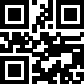
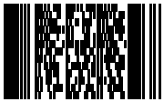

# SGKBarcodeBundle

[](https://travis-ci.org/shangguokan/SGKBarcodeBundle)
[](https://packagist.org/packages/sgk/barcode-bundle) [](https://packagist.org/packages/sgk/barcode-bundle) [](https://packagist.org/packages/sgk/barcode-bundle) [](https://packagist.org/packages/sgk/barcode-bundle)

SGKBarcodeBundle est un Symfony2 Bundle pour l’objet de générer tous les types de code-barres !
Ce document README ont aussi une version Anglaise ([English]( https://github.com/shangguokan/SGKBarcodeBundle)) et une version Chinoise ([中文]( README_zh-CN.md)).

Caractéristiques:

1. Capable de générer 3 types de codes-barres bidimensionnels (2D) et 30 types de codes-barres unidimensionnels (1D)
2. Trois formats de sortie : HTML, PNG and SVG canvas
3. Twig intégration: vous pouvez directement utiliser une Twig fonction dans le Template pour générer les codes-barres
4. Ce Bundle est un portage depuis le Laravel project: [dinesh/barcode](https://github.com/dineshrabara/barcode)


## Installation

Ajoutez SGKBarcodeBundle via exécuter le command:
```sh
// Symfony version < 2.7
$ php composer.phar require sgk/barcode-bundle:~1.0

// Symfony version >= 2.7
$ php composer.phar require sgk/barcode-bundle:~2.0
```

Ou ajoutez la dépendance de  SGKBarcodeBundle à votre fichier ``composer.json``, puis mettez à jour les bibliothèques vendor : ``php composer.phar update``
```json
// Symfony version < 2.7
"require": {
        "sgk/barcode-bundle": "~1.0"
    }

// Symfony version >= 2.7
"require": {
        "sgk/barcode-bundle": "~2.0"
    }
```

Composer téléchargera automatiquement tous les fichiers requis, et les installera pour vous sous le répertoire vendor/sgk.

Ensuite, comme pour tout autre bundle, incluez dans votre classe Kernel: 
```php
<?php
// app/AppKernel.php

public function registerBundles()
{
    $bundles = array(
        // ...
        new SGK\BarcodeBundle\SGKBarcodeBundle(),
    );
}
```

## Paramètres de génération

Vous avez 5 paramètres (options) à choisir pour la génération d’un code-barres.

|option|type       |requis|valeur possible|description          |
|:----:|:---------:|:------:|:------------:|:-------------------:|
|code  |string     |obligatoire|              |ce que vous voulez encoder|
|type  |string     |obligatoire|[Types disponible](#type-de-code-barres-disponible)|type de code-barre|
|format|string     |obligatoire|html, svg, png|format de sortie|
|width |**integer**|optionnel|              |**largeur de unit**|
|height|**integer**|optionnel|              |**hauteur de unit**|
|color |string (html, svg) / array (png)|optionnel|[HTML Color Names](http://www.w3schools.com/html/html_colornames.asp) / array(R, G, B)|couleur|

> Valeur par défaut de width et height pour les codes-barres 2D sont 5, 5, pour les codes-barres 1D sont 2, 30.
> Valeur par défaut de couleur pour les fomarts html et svg est black, pour png est array(0, 0, 0)

## Utilisation par service
  
Ce bundle crée un service ``sgk_barcode.generator``  dans le Conteneur, cela vous permettez de l’utiliser pour générer le code-barres d’une façon très simple.

* outpout html
```php
$options = array(
    'code'   => 'string to encode',
    'type'   => 'c128',
    'format' => 'html',
);

$barcode =
    $this->get('sgk_barcode.generator')->generate($options);
    
return new Response($barcode);
```

* outpout svg
```php
$options = array(
    'code'   => 'string to encode',
    'type'   => 'qrcode',
    'format' => 'svg',
    'width'  => 10,
    'height' => 10,
    'color'  => 'green',
);

$barcode =
    $this->get('sgk_barcode.generator')->generate($options);
    
return new Response($barcode);
```

* outpout png
```php
$options = array(
    'code'   => 'string to encode',
    'type'   => 'datamatrix',
    'format' => 'png',
    'width'  => 10,
    'height' => 10,
    'color'  => array(127, 127, 127),
);

$barcode =
    $this->get('sgk_barcode.generator')->generate($options);

return new Response('');
```
> Si vous choisissez le format png, le générateur retournera le donnée based64 de png fichier, vous pouvez obtenir le donnée original via ``base64_decode($barcode)``. Ici on prend [Data URI scheme](http://en.wikipedia.org/wiki/Data_URI_scheme) pour directement afficher le png image sur webpage.

## Utilisation dans le Twig Template

Ce bundle crée une fonction de Twig ``barcode`` que vous pouvez l’utiliser directement dans le Twig Template.

``barcode`` prend les mêmes paramètres (options), la seule chose différente est que vous avez besoin de passer un [Twig tableau](http://twig.sensiolabs.org/doc/templates.html#literals) (qui vraiment ressemble à Json, mais il n’est pas) dans la fonction.

* display html
```twig
{{ barcode({code: 'string to encode', type: 'c128', format: 'html'}) }}
```

* display svg
```twig
{{ barcode({code: 'string to encode', type: 'qrcode', format: 'svg', width: 10, height: 10, color: 'green'}) }}
```

* display png
```twig

```

## Utilisation sans service

```php
use SGK\BarcodeBundle\Generator\Generator;
//...
$options = array(
    'code'   => 'string to encode',
    'type'   => 'qrcode',
    'format' => 'html',
);

$generator = new Generator();
$barcode = $generator->generate($options);

return new Response($barcode);
```

## Enregistrer les codes-barres dans les fichiers

Comme vous avez vu, ce Bundle n’enregistre rien sur vos ordinateurs, mais si vous voulez les enregistrer, il n’y aura pas de problème !

* save as html
```php
$savePath = '/tmp/';
$fileName = 'sample.html';

file_put_contents($savePath.$fileName, $barcode);
```

* save as svg
```php
$savePath = '/tmp/';
$fileName = 'sample.svg';

file_put_contents($savePath.$fileName, $barcode);
```

* save as png
```php
$savePath = '/tmp/';
$fileName = 'sample.png';

file_put_contents($savePath.$fileName, base64_decode($barcode));
```

## Type de code-barres disponible

Jetez un coup d'œil à [Wikipedia page](http://en.wikipedia.org/wiki/Barcode) pour savoir quel type vous devez choisir. 

### 2d barcodes

|type      |Name                                                   |Example(encode 123456)|
|:--------:|:-----------------------------------------------------:|:--------------------:|
|qrcode    |[QR code](http://en.wikipedia.org/wiki/QR_code)        ||
|pdf417    |[PDF417](http://en.wikipedia.org/wiki/PDF417)          ||
|datamatrix|[Data Matrix](http://en.wikipedia.org/wiki/Data_Matrix)||

### 1d barcodes

|type    |Symbology                                              |Example(encode 123456)|
|:------:|:-----------------------------------------------------:|:--------------------:|
|c39     |[Code 39](http://en.wikipedia.org/wiki/Code_39)        ||
|c39+    |Code 39 CHECK_DIGIT                                    ||
|c39e    |Code 39 EXTENDED                                       ||
|c39e+   |Code 39 EXTENDED CHECK_DIGIT                           ||
|c93     |[Code 93](http://en.wikipedia.org/wiki/Code_93)        ||
|s25     |[Standard 2 of 5](http://www.barcodeisland.com/2of5.phtml)           ||
|s25+    |Standard 2 of 5 CHECK_DIGIT                                          ||
|i25     |[Interleaved 2 of 5](http://en.wikipedia.org/wiki/Interleaved_2_of_5)||
|i25+    |Interleaved 2 of 5 CHECK_DIGIT                                       ||
|c128    |[Code 128](http://en.wikipedia.org/wiki/Code_128)                    ||
|c128a   |Code 128A||
|c128b   |Code 128B||
|c128c   |Code 128C||
|ean2    |[EAN 2](http://en.wikipedia.org/wiki/EAN_2)                 ||
|ean5    |[EAN 5](http://en.wikipedia.org/wiki/EAN_5)                 ||
|ean8    |[EAN 8](http://en.wikipedia.org/wiki/EAN-8)                 ||
|ean13   |[EAN 13](http://en.wikipedia.org/wiki/EAN-13)               ||
|upca    |[UPC-A](http://en.wikipedia.org/wiki/Universal_Product_Code)||
|upce    |[UPC-B](http://en.wikipedia.org/wiki/Universal_Product_Code)||
|msi     |[MSI](http://en.wikipedia.org/wiki/MSI_Barcode)             ||
|msi+    |MSI CHECK_DIGIT                                             ||
|postnet |[POSTNET](http://en.wikipedia.org/wiki/POSTNET)             ||
|planet  |[PLANET](http://en.wikipedia.org/wiki/Postal_Alpha_Numeric_Encoding_Technique)||
|rms4cc|[RMS4CC](http://en.wikipedia.org/wiki/RM4SCC)    ||
|kix     |[KIX-code](http://nl.wikipedia.org/wiki/KIX-code)||
|imb     |[IM barcode](http://en.wikipedia.org/wiki/Intelligent_Mail_barcode)||
|codabar |[Codabar](http://en.wikipedia.org/wiki/Codabar)                    ||
|code11  |[Code 11](http://en.wikipedia.org/wiki/Code_11)                    ||
|pharma  |[Pharmacode](http://en.wikipedia.org/wiki/Pharmacode)              ||
|pharma2t|Pharmacode Two-Track                                               ||

## Dépendance

Si vous avez rencontré quelque problème de dépendance, vérifierez que vous avez bien installé les deux extensions de PHP (dans phpinfo()).

- [GD](http://php.net/manual/en/book.image.php) et [ImageMagick](http://php.net/manual/en/book.imagick.php) pour créer les PNGs sous PHP 5.3.
- [PHP bcmath](http://php.net/manual/en/book.bc.php) extension pour générer le format Intelligent Mail barcodes (IMB)

## Tests

Exécuter les tests unitaires:
```sh
$ phpunit --coverage-text
```
